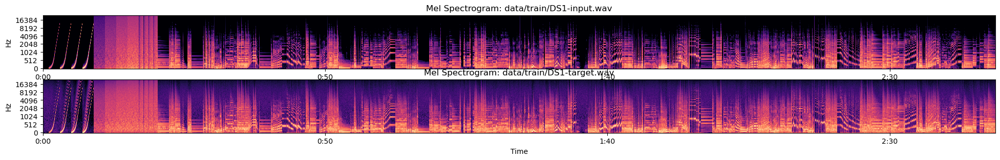
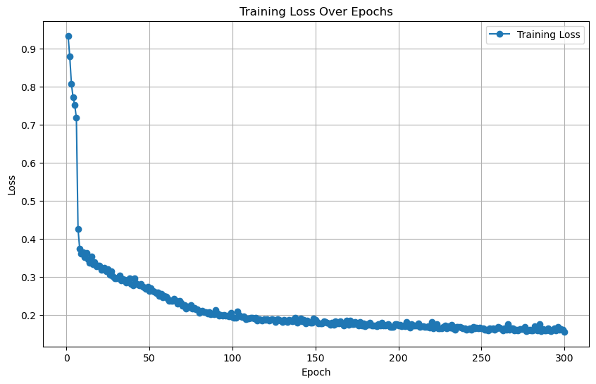

# rnn-distortion-emulator

FA24 Machine Learning Final Project

## Introduction

In my project proposal, I said:

"In my final project, I am going to leverage an RNN to train a black-box model on audio data to learn the nonlinear signal transformation applied by analog distortion effects for electric guitar. This data will be collected from real hardware. I will also be attempting to infer from this model in real time using a reasonably powerful DSP platform like the Daisy Seed to evaluate its efficacy as a live effects unit itself."

## Why an RNN?

Recurrent Neural Networks (RNNs) are designed to process sequential data, making them ideal for tasks involving time-dependent or ordered inputs, such as audio signals. Tasks like audio synthesis, music generation, and effect emulation require the model to consider past inputs for generating current outputs. If, say, a normal linear layer or MLP tries to do this, it will suffer the vanishing gradient problem and "forget" potentially important past inputs. RNNs excel at these kinds of tasks because they process data step-by-step while preserving the sequence structure. There are two common variants of the RNN: the Long Short-Term Memory (LSTM) and the Gated Recurrent Unit (GRU). In this project, I'll be using a GRU.

## Why a GRU?

GRUs use gating mechanisms (reset and update gates) to control the flow of information, helping mitigate the vanishing gradient problem. GRUs are similar to Long Short-Term Memory (LSTM) networks but have fewer parameters because they lack a separate memory cell. This simplicity reduces computational overhead and speeds up training, making GRUs a good choice when computational resources are limited or when the dataset size is relatively small. Most importantly to my situation, GRUs are computationally lighter compared to LSTMs, which is advantageous for real-time audio applications like virtual instrument plugins, effects processing, or live audio emulation. The Daisy Seed microcontroller is only capable of running a GRU with a hidden size of 10 before the fully connected layer.

## Data Collection

`Proteus_Capture_48kHz.wav` is a 3 minute and 30 second long audio clip that contains a few different sounds: some exponential chirps at increasing volumes, some exponential pink noise swells at increasing volumes, and many short clips of guitar playing samples. This variety of data can be beneficial to train the RNN on for a couple of reasons:

**Chirps** cover a wide frequency spectrum due to their exponential nature, allowing the model to learn how to handle a diverse range of frequencies. This helps in generalizing the frequency response modeling. **Pink noise swells** have a frequency distribution that resembles natural audio signals (emphasizing lower frequencies), which can help the model learn to handle complex, realistic audio dynamics. Including sounds at increasing volumes ensures the model is exposed to a variety of signal amplitudes. This can help the model generalize better to handle low and high-volume inputs without introducing artifacts.

**Guitar samples**, of course, provide real-world examples of the type of input the model is likely to encounter, enhancing its ability to emulate guitar-related effects or amplifiers. Nonlinear systems like guitar amplifiers and distortion pedals often produce different harmonic and intermodulation artifacts depending on the input frequency and amplitude. By training on diverse input signals, the model can better learn these nonlinear characteristics.

Using a loopback setup on my audio interface, I recorded `Proteus_Capture_48kHz.wav` through the Boss DS-1 Distortion Pedal to produce the target. The spectrograms of the two datasets (input and target) are shown below:

The target audio file appears a little blurrier in the spectrogram. This is due to the distortion-induced harmonic frequencies being introduced into the signal, giving the analog distortion effect its signature sound.

## Data Pre-processing

Using the `run_preprocessing.py` script, both the input and target audio data are put through a few checks and edits to make sure it is suitable to feed to the RNN. The WAV files are loaded, the sampling rate is checked to be 48kHz, and the audio files are trimmed to the same duration. If either file is in stereo, it is collapsed into mono. A key step in this process is **normalization**, where the audio data is scaled to ensure its amplitude values lie within the range -1 to 1. This ensures an objective comparison between the two signals. Most importantly, the audio data is split contiguously into an 80/10/10 train/test/val split. The split is done sequentially, preserving the order of the samples. RNNs are designed to capture temporal dependencies in sequential data. Audio signals, in particular, have inherent time dependencies where the current sample is influenced by preceding samples. If the data were shuffled arbitrarily, the temporal structure would be disrupted, making it harder for the RNN to learn meaningful patterns and relationships in the data.

## Model Configuration

In `run_training.py`, I configure the RNN to have the following features and parameters:

-   One recurrent layer, one fully connected layer

-   Input size 1 (for mono audio)

-   Hidden size 10

-   Output size 1 (for mono audio)

-   GRU unit type

-   1 residual skip connection; skip connections allow gradients to flow more directly back to earlier layers, helping prevent them from vanishing and making the training process more stable.

## Training Loop

The main training loop of `run_training.py` runs for 300 epochs with a batch size of 50. Optimization is done through the Adam optimizer, and I'm using a custom loss function that is detailed in the paper. The learning rate is 0.0005. On my laptop's CUDA, this took about 5-10 minutes. The best model was saved as a JSON file in the `/results` directory, as was a CSV log of the training loss (plotted below). Models trained like this seemed to converge anywhere from 0.15 to 0.07 with these hyperparameters.

## Inference

Using the `convert_json_to_c_header_gru.py` script, the JSON file containing the final model weights was converted to a data structure stored into a C header file. This was then directly imported into the NeuralSeed framework for the Daisy Seed microcontroller for real-time inference. The NeuralSeed environment loads the pre-trained model weights into its memory and executes forward passes of the audio data on a sample-by-sample basis through the model layer by layer. The result is a decently performing, ultra low-latency emulation of the DS-1 analog distortion pedal.

#### To be transparent, much of the material used to train this model is educated by and based on the code and research of others. Here is a list of my primary reference literature and repositories (same as listed in my project proposal)

## References

This paper proposes using specifically Long Short-Term Memory (LSTM) and Gated Recurrent Units (GRU) to model nonlinear audio systems like tube amplifiers and distortion pedals. Compared to the WaveNet model (a CNN solution for nonlinear modeling two years prior to this paper), RNNs achieve similar accuracy with much lower processing requirements. Training involved passing guitar and bass recordings through the devices. This project is a rough reimplementation of this study.

Wright, A., Damskägg, E.-P., & Välimäki, V. (2019). Real-time black-box modelling with recurrent neural networks. Proceedings of the 22nd International Conference on Digital Audio Effects (DAFx-19), Birmingham, UK, September 2–6, 2019. Retrieved from <http://research.spa.aalto.fi/publications/papers/dafx19-rnn/​>

**Repositories**

-   [CoreAudioML](https://github.com/Alec-Wright/CoreAudioML/tree/main) contains Python functions and classes used in audio data preprocessing and training neural network models of audio effects. Based on Pytorch and TorchAudio, and created by Alec Wright, a primary author of the above publication. I use my own branch of this package as a submodule and have refactored the network and dataset scripts to work with my CUDA setup.

-   [Automated-GuitarAmpModeling](https://github.com/Alec-Wright/Automated-GuitarAmpModelling) (Alec Wright) contains Python training scripts and some trained models on distortion-based audio effects. Uses CoreML functions to take in audio data and hyperparameters and stores trained model weights in a JSON file. `run_preprocessing.py` and `run_training.py` are essentially very truncated versions of a collection of functions from this repository, refactored for my particular purposes. I also added some datalogging functions.

-   [RTNeural](https://github.com/jatinchowdhury18/RTNeural) (jatinchowdhury18) is a C++ library for real-time inference from many neural network types, including RNNs.

-   [NeuralSeed](http://github.com/GuitarML/NeuralSeed) (GuitarML's Keith Bloemer) Takes RNN models generated from the Wright repos and uses RTNeural to do signal processing inference on the Daisy microcontroller. `convert_json_to_c_header_gru.py` is originally from this repository, refactored for my purposes.

    -   GuitarML also has a fork of a Wright repo that contains the original audio training data `Proteus_Capture_48kHz.wav`.

##
